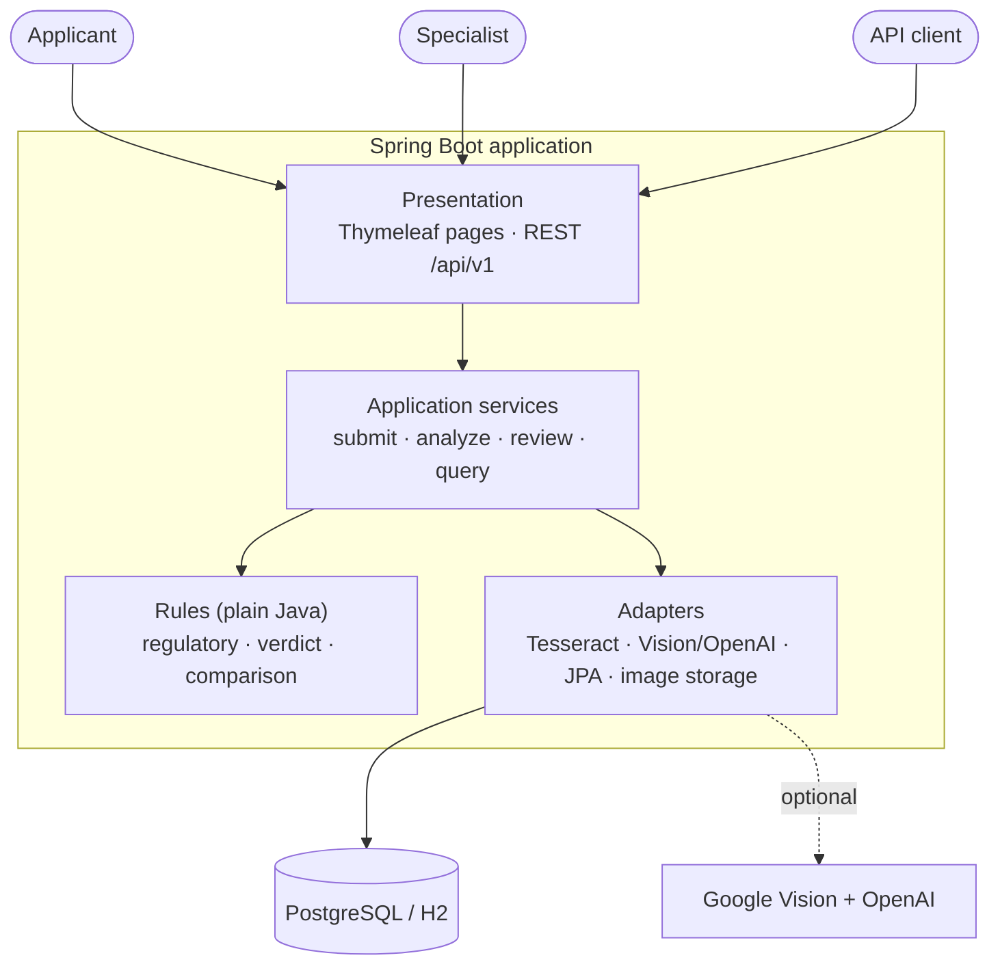

# TTB Label Verification

AI-assisted compliance checking of alcohol beverage labels, built for labeling specialists at TTB (the Alcohol and Tobacco Tax and Trade Bureau).

**Author:** SarvariVin · **Last updated:** 2026-09-27

An applicant uploads photos of a label together with the COLA application data it should match (TTB Form 5100.31). The service reads the label with OCR, lines up every regulated field against what was declared, and suggests a verdict. A specialist makes the call: batch-approves the clean ones, resolves fields one by one, or sets the final status with a written reason. Every decision is kept in an audit trail.

**Runs entirely on your own machine by default.** Tesseract OCR does the reading, and no API keys are needed. An optional cloud pipeline (Google Cloud Vision plus OpenAI) adds outlines on the label image and detects which side of the bottle an image shows.

## Try the live demo

**Live site:** https://alclabelverification-production.up.railway.app/login

> [!IMPORTANT]
> **No password needed.** The demo site runs in demo mode, so you choose an account and the form fills itself in.
>
> 1. Open the sign-in page and **click the Email field**. A **Demo accounts** list appears.
> 2. **Choose a user.** Each entry shows initials, name, email and a **Specialist** or **Applicant** badge. Type part of a name to filter, or use ↑ / ↓ and Enter.
> 3. The **email and password fill in by themselves**, with the password shown as dots.
> 4. **Sign in** is already highlighted, so **press Enter**.

| Account | Role | Company | What to try |
|---------|------|---------|-------------|
| Specialist Two · `specialist2@example.gov` | Specialist | — | Work the queues, batch approve, override, change settings |
| Specialist Three · `specialist3@example.gov` | Specialist | — | The same, as a second reviewer |
| Applicant Two · `applicant2@example.com` | Applicant | Aldercrest Distilling Co. | Submit labels and follow your own results |
| Applicant Three · `applicant3@example.com` | Applicant | Quillmoor Cellars | Submit labels and follow your own results |
| Applicant Four · `applicant4@example.com` | Applicant | Tidewater Row Brewing Co. | Submit labels and follow your own results |
| Applicant Five · `applicant5@example.com` | Applicant | Northvale Spirits | Submit labels and follow your own results |

These accounts are defined on the demo deployment through `APP_USERS`. A fresh deployment instead starts with the three [bootstrap accounts](#accounts-on-a-fresh-install).

> [!NOTE]
> - The password that fills in is a random placeholder. The server keeps only password hashes, so a real password never reaches the browser.
> - If you change the email or password after choosing an account, the form switches back to a normal password check, and you'll need the real password.
> - With JavaScript turned off, a plain **Demo account** list and a **Sign in as selected** button appear instead.

> [!WARNING]
> In demo mode, **anyone who can open the site** can sign in as these accounts. It is enabled with `APP_DEMO_LOGIN=true` (off by default), and each startup logs a warning while it is on. Switch it off for any real use. See [docs/user-accounts.md](docs/user-accounts.md#demo-mode-choosing-an-account-on-the-login-page).

**A five-minute tour:**

1. **As an applicant** (say Applicant Two), open **New submission** and pick an image from [test-labels/](test-labels/). The form fills itself from the label in under a second. Check the values and submit.
2. **Sign out and come back as a specialist** (say Specialist Two). Compliant labels wait under **Ready to approve**, and flawed ones under **Needs review**, each with the AI's recommendation and field-by-field findings.

## What's new

| Change | What it means |
|--------|---------------|
| **Refreshed interface** | A navy app bar with a highlighted current page, summary tiles on both dashboards, segmented queue tabs, status badges with a dot and a label, color-edged field rows, a numbered submission form with a sticky submit bar, and a styled error page. Every page works on a phone with no sideways scrolling. See [docs/ui.md](docs/ui.md) and [ADR-0021](docs/adr/0021-design-tokens-and-shared-page-chrome.md). |
| **New sign-in page** | A split screen: a brand panel explaining *read → compare → decide*, beside a clean form. On phones it becomes a compact header. The demo-account picker works as before. |
| **Three bootstrap accounts** | A fresh database now gets one specialist and **two test applicants from different companies**, so the "applicants see only their own labels" rule can be tried straight away. |
| **Sessions survive restarts** | HTTP sessions live in the database (Spring Session JDBC, Flyway `V3__http_sessions.sql`), so restarts and Railway sleep/wake no longer sign people out. |
| **Stricter health-warning check** | The warning only matches when the `GOVERNMENT WARNING:` landmark and **all six** key body phrases can be read. A label missing clause (2) is now **Rejected**; previously it could be approved. A title-case prefix is caught even when OCR misreads a letter. |
| **Near misses are judged, not assumed** | A partial match is compared as it actually reads on the label. For example, "…Distillery, Portland, Maine" no longer passes for a declared "…Distillery, Austin, Texas". |
| **Numbers must match in full** | A declared `5%` is no longer found inside `4.5%`. Alcohol content that differs by **0.5 points or more** is a mismatch, and `1L` on a label matches a declared `1 L`. |
| **34-label production run** | Synthetic labels covering clean, degraded (rotated, blurred, heavy JPEG, 640 px, noisy, low-contrast, light-on-dark) and deliberately flawed cases went through the live site. OCR read each one in 0.5–0.9 s. The run uncovered the matching bugs above, and after the fixes **33 of 34** got the expected verdict. The last one follows a documented rule (see [Known limitations](#known-limitations)). |

## Quick start

### No setup: in-memory database

You need Java 21 and Tesseract 5.

```bash
brew install tesseract
```

```bash
./mvnw spring-boot:run -Dspring-boot.run.profiles=demo
```

Go to http://localhost:8080. On the first start, the log lists the three bootstrap accounts and a generated password. Set `APP_SEED_PASSWORD` beforehand to choose the password yourself, or add `APP_DEMO_LOGIN=true` to use the account picker.

### With PostgreSQL

```bash
cp .env.example .env
```

Fill in `DATABASE_USERNAME`, `DATABASE_PASSWORD` and `APP_SEED_PASSWORD` in `.env`, then run:

```bash
docker compose up -d postgres
```

```bash
set -a && source .env && set +a && ./mvnw spring-boot:run
```

Flyway builds the schema. An empty database gets the bootstrap accounts and default settings, but no labels: every label goes through the real pipeline.

### Accounts on a fresh install

| Account | Role | Company | Default email |
|---------|------|---------|---------------|
| Labeling Specialist | Specialist | — | `specialist@example.gov` |
| Test Applicant One | Applicant | Sample Distilling Co. | `applicant@example.com` |
| Test Applicant Two | Applicant | Sample Winery LLC | `applicant.two@example.com` |

All three share `APP_SEED_PASSWORD`, or the generated one from the log. Emails and company names can be changed with `APP_SEED_*` variables ([docs/user-accounts.md](docs/user-accounts.md#bootstrap-accounts)).

### Walk through it

[test-labels/](test-labels/) holds synthetic labels (fictional brands) with their application data, including one label that is non-compliant on purpose.

1. Sign in as **Test Applicant One** and open **New submission**.
2. Pick `test-labels/aldercrest-bourbon/front.png`. The label is read straight away and the form is **pre-filled**: product type, capacity, brand, class/type, alcohol content, net contents, qualifying phrase, name and address, and age statement.
3. Compare the highlighted values with `application.json`, then submit.
4. Sign in as **Test Applicant Two**. None of the first company's labels are visible.
5. Sign in as the **Labeling Specialist**. The label is waiting under **Ready to approve**.

## How it works

1. **Submit.** The applicant picks label images, and the form fills itself from the label text for them to confirm against their application. Labels can be sent through the web form, the REST API, or a CSV batch of up to 50 rows.
2. **Analyze.** OCR reads the label, each declared field is found and compared, and within about a second the label moves to *Pending review* with an **AI-proposed status** and a confidence score.
3. **Decide.** The specialist works two queues:
   - **Ready to approve:** the AI proposes approval, every field matches, and confidence is at or above the threshold (90% by default). These can be approved in a batch.
   - **Needs review:** resolve individual fields (match, mismatch or not found) and the status is worked out again, or set the final status directly with a justification.

### Verdict rules

| Outcome | When | Time to correct |
|---------|------|-----------------|
| **Rejected** | The health warning is missing, incomplete (any clause absent), wrong, or its `GOVERNMENT WARNING:` prefix isn't in capitals (always checked against the statutory text), or the container size is illegal | — |
| **Needs correction** | A mandatory field is missing or doesn't match | 30 days |
| **Conditionally approved** | Only minor fields (brand, fanciful name, appellation, varietal) or optional fields differ | 7 days |
| **Approved** | Everything matches | — |

When a deadline passes, the label is downgraded the next time it's read. There's no scheduler to run.

### How fields are compared

| Field | Strategy | Example |
|-------|----------|---------|
| Health warning, vintage year | Exact | Whitespace is normalized, the prefix must be in capitals, and all six key phrases must be readable |
| Brand, class/type, name and address | Fuzzy | `STONE'S THROW` = `Stone's Throw`, but `…Portland, Maine` ≠ `…Austin, Texas` |
| Alcohol content | Numeric | `45% Alc./Vol. (90 Proof)` = `45%`, but `40%` ≠ `42%`, `6.0%` ≠ `5.5%` and `5%` ≠ `4.5%` |
| Net contents | Numeric | `750 mL` = `75 cL` = `0.75 L`, and `1L` = `1 L` |
| Age statement | Numeric | `Aged 6 years` = `6 Years Old` |
| Country of origin | Contains | `Product of Scotland` ⊇ `Scotland` |
| Qualifying phrase | Enumerated | `BOTTLED BY` = `Bottled by`, but `Bottled by` ≠ `Distilled by` |

On the bundled samples with local OCR, the three compliant labels come out **Approved** with every field matched, in about 0.5–0.8 s each. The flawed one comes out **Rejected**, with the wrong ABV and the title-case warning prefix flagged. Across 34 synthetic labels, 33 got the expected verdict. More in [docs/ai-pipelines.md](docs/ai-pipelines.md).

### Deploying to Railway

The repository ships `railway.json` and a `railway` Spring profile sized for a 512 MB container, with a measured peak of 402 MB. You need two services: the app, built from the `Dockerfile`, and PostgreSQL. [docs/deploy-railway.md](docs/deploy-railway.md) covers the free-plan fit, variables, steps, checks and troubleshooting.

## Architecture at a glance

The application is a modular monolith arranged in layers, and dependencies point toward the regulatory rules, which never depend on the framework.



| Topic | Where to read |
|-------|---------------|
| Context, containers, layers, runtime flows, data, security | [docs/architecture.md](docs/architecture.md) |
| Page anatomy, design tokens, components, responsive rules | [docs/ui.md](docs/ui.md) |
| Local, container and production hosting, network zones, CI/CD | [docs/infrastructure.md](docs/infrastructure.md) |
| Why it's built this way (21 ADRs) | [docs/adr/](docs/adr/README.md) |
| Deploying on Railway (free or Hobby plan) | [docs/deploy-railway.md](docs/deploy-railway.md) |
| Diagram sources (17 Mermaid files) | [docs/diagrams/](docs/diagrams/README.md) |

## Stack

| Layer | Technology |
|-------|------------|
| Runtime | Java 21 with virtual threads |
| Framework | Spring Boot 3.5: Web MVC, Data JPA, Security, Validation, Actuator |
| UI | Server-rendered Thymeleaf with shared layout fragments, one token-based stylesheet, and JavaScript only for conveniences |
| Database | PostgreSQL 17 (H2 for the demo and tests), with Flyway migrations |
| Sessions | Spring Session JDBC, stored in the database |
| OCR | Tesseract 5 through Tess4J (local), or Google Cloud Vision REST (cloud) |
| Classification | OpenAI Chat Completions with a strict JSON schema (cloud) |
| Testing | JUnit 5, AssertJ, Spring MockMvc and spring-security-test: 117 tests, including real-OCR end-to-end runs |

## Project layout

```
.
├── pom.xml, mvnw                  Maven build (wrapper included)
├── Dockerfile, docker-compose.yml Container image and local infrastructure
├── railway.json                   Railway build/deploy configuration
├── .env.example                   Every configuration variable (no values for secrets)
├── .mvn/wrapper/                  Maven wrapper settings (needed by the Docker build)
├── scripts/
│   ├── ci.sh                      Vendor-neutral CI entry point
│   └── SampleLabelGenerator.java  Regenerates the synthetic sample labels
├── docs/                          Architecture, UI guide, infrastructure, ADRs, pipelines, API, flows
├── test-labels/                   Synthetic labels + application data + batch CSV
└── src/
    ├── main/java/gov/ttb/labelverification/
    │   ├── regulatory/            TTB rules as code
    │   ├── labels/                Verdict, deadlines, lazy status recovery
    │   ├── ai/                    local/, cloud/, ocr/, compare/, prefill/
    │   ├── domain/ repository/    JPA entities and repositories
    │   ├── storage/               Image storage and validation
    │   ├── service/               Use cases
    │   ├── security/ config/      Security, properties, bootstrap
    │   └── web/                   page/ (Thymeleaf) and api/ (REST)
    ├── main/resources/            Flyway migrations, Thymeleaf templates, app.css (design tokens), app.js
    └── test/                      Unit and integration tests
```

The package guide is at [src/main/java/gov/ttb/labelverification/README.md](src/main/java/gov/ttb/labelverification/README.md).

## Commands

Run the tests:

```bash
./mvnw test
```

Run the CI entry point:

```bash
./scripts/ci.sh
```

Build and run the jar:

```bash
./mvnw package && java -jar target/label-verification-0.1.0-SNAPSHOT.jar
```

Run the app and PostgreSQL in containers:

```bash
docker compose --profile app up --build
```

Regenerate the sample labels:

```bash
java scripts/SampleLabelGenerator.java test-labels
```

## Configuration

Every variable is listed in [.env.example](.env.example). No credential has a default value.

| Variable | What it controls |
|----------|------------------|
| `DATABASE_URL`, `DATABASE_USERNAME`, `DATABASE_PASSWORD` | The PostgreSQL connection |
| `APP_SEED`, `APP_SEED_PASSWORD` | Bootstrap accounts on an empty database (one specialist and two test applicants). Set `APP_SEED=false` in production. |
| `APP_SEED_SPECIALIST_EMAIL`, `APP_SEED_APPLICANT_EMAIL`, `APP_SEED_APPLICANT2_EMAIL` (and the `…_COMPANY` variables) | Bootstrap emails and company names |
| `APP_USERS` | More specialists and applicants as JSON, preferably with bcrypt hashes ([docs/user-accounts.md](docs/user-accounts.md)) |
| `APP_DEMO_LOGIN`, `APP_DEMO_LOGIN_ACCOUNTS` | The passwordless demo-account picker on the sign-in page (off by default, for demos only) |
| `TESSDATA_PREFIX`, `TESSERACT_LIBRARY_PATH` | Where Tesseract lives, when auto-detection fails |
| `GOOGLE_VISION_API_KEY` + `OPENAI_API_KEY` | Turn on the cloud pipeline (both are required) |
| `OPENAI_MODEL` | The classification model |
| `APP_STORAGE_TYPE`, `APP_STORAGE_DIR` | Image storage: `filesystem` (the default, in a directory) or `database` |
| `SPRING_PROFILES_ACTIVE=railway` | The small-container profile: images in the database, one OCR job at a time, HTTPS proxy support |
| `OCR_MAX_CONCURRENT`, `DB_POOL_SIZE`, `TOMCAT_MAX_THREADS`, `JAVA_OPTS` | Sizing |

Runtime settings (pipeline, approval threshold, SLA targets) are changed by specialists at **/settings** or through `PUT /api/v1/settings`.

## REST API

Stateless, with HTTP Basic authentication. The full reference is [docs/api.md](docs/api.md).

| Method | Path | Role |
|--------|------|------|
| GET | `/api/v1/labels?queue=ready\|review\|all` | any (scoped) |
| GET | `/api/v1/labels/{id}` | any (scoped) |
| POST | `/api/v1/labels/extract` (multipart) — pre-fill suggestions | applicant |
| POST | `/api/v1/labels` (multipart) | applicant |
| POST | `/api/v1/labels/{id}/review` | specialist |
| POST | `/api/v1/labels/{id}/override` | specialist |
| POST | `/api/v1/labels/{id}/reanalyze` | specialist |
| POST | `/api/v1/labels/batch-approve` | specialist |
| GET | `/api/v1/images/{id}` | any (scoped) |
| GET/PUT | `/api/v1/settings` | specialist |

## Known limitations

- **Image resolution.** Local OCR needs readable small print, which means roughly 1000 px or wider for a full label. On low-resolution photos the health warning may not be readable, so the label is proposed *Rejected* and a specialist resolves that field after looking at the image. Because all six key warning phrases must be readable, blurry real photos end up in review more often. That trade-off is deliberate: a wrong rejection is easy for a specialist to fix, but a wrong approval would go unnoticed.
- **Optional fields missing from the label don't count.** If an applicant declares an optional field (a fanciful name, say) that isn't on the label at all, the verdict is unaffected. A declared value that *differs* from the label is still flagged.
- **Pre-fill is rule-based in local mode.** It works well on clearly printed labels. On decorative or low-resolution labels, some fields may stay empty and have to be typed in.
- **The cloud pipeline hasn't been run against live services** in this repository, and bounding-box overlays and image-type detection depend on it.
- **Field-strictness settings** are stored and shown, but don't yet change the comparison thresholds.
- **Analysis happens inside the submit request** (60 s timeout). The queue-based design is described in [docs/infrastructure.md](docs/infrastructure.md#6-scaling-target).

## Documentation

| Document | What's in it |
|----------|--------------|
| [docs/architecture.md](docs/architecture.md) | The internal design as a set of views, with diagrams |
| [docs/ui.md](docs/ui.md) | The UI guide: page anatomy, design tokens, components, responsive rules, accessibility |
| [docs/infrastructure.md](docs/infrastructure.md) | Hosting topologies, network zones, CI/CD, secrets, sizing |
| [docs/deploy-railway.md](docs/deploy-railway.md) | The Railway deployment guide, measured memory, troubleshooting |
| [docs/adr/](docs/adr/README.md) | Architecture decision records |
| [docs/ai-pipelines.md](docs/ai-pipelines.md) | OCR, field search, the comparison engine, measured results |
| [docs/performance.md](docs/performance.md) | Processing times, concurrency, resolution effects and memory (local benchmark) |
| [docs/api.md](docs/api.md) | The REST reference |
| [docs/user-accounts.md](docs/user-accounts.md) | Bootstrap accounts, `APP_USERS`, and demo mode |
| [docs/user-flows.md](docs/user-flows.md) | Applicant and specialist workflows, and edge cases |
| [docs/test-scenarios.md](docs/test-scenarios.md) | 153 test scenarios with automated, live and browser evidence |
| [docs/production.md](docs/production.md) | The production-readiness checklist and roadmap |
