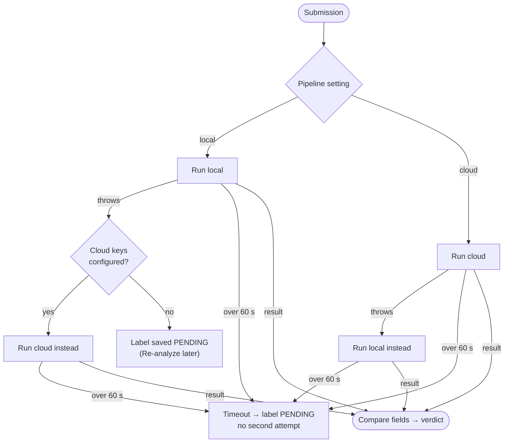

# AI Pipelines

This page covers the verification engine end to end: how text is pulled off a label image, how each regulated field is located, and how the result is judged against the COLA application.

```
            Stage 1           Stage 2                      Stage 3               Judge
Images ──▶  OCR       ──▶  locate / classify fields  ──▶  bounding boxes  ──▶  FieldComparator ──▶ StatusDeterminer
```

## Two interchangeable pipelines

| | **Local**, the default | **Cloud**, opt-in |
|---|---|---|
| Stage 1: read text | Tesseract 5 through Tess4J, on the same host | Google Cloud Vision `TEXT_DETECTION` over REST |
| Stage 2: find fields | `OcrTextSearch` looks for each *declared* value in the OCR text | OpenAI Chat Completions with a strict JSON schema |
| Stage 3: locate fields | Not available (no word geometry) | `BoundingBoxMath` joins the boxes of the words assigned to each field |
| Prerequisites | `libtesseract` and `eng.traineddata` | Both `GOOGLE_VISION_API_KEY` **and** `OPENAI_API_KEY` |
| Overlays on the label image | No | Yes |
| Image-type detection | No | Yes: front, back, neck or strip, applied at 60% confidence or higher |
| Typical time per label | About 0.5–0.8 s (measured on the samples) | About 2–5 s |
| Cost per label | Nothing | Roughly $0.003–0.004 (Vision about $0.0015 per image, plus a short LLM call) |
| `model_used` stored | `tesseract-local` | `google-vision+<openai-model>` |

## Choosing a pipeline, and what happens on failure

`ExtractionService` follows the `settings.submission_pipeline_model` setting. It defaults to `local`, and specialists can change it on `/settings`.



- Each run gets a hard limit of `app.pipeline.timeout` (60 s by default) and runs on a virtual thread.
- **A timeout never triggers the other pipeline.** Starting a second slow run would only double the wait.
- The stored `model_used` always names the pipeline that actually produced the result.

## Local pipeline

### Reading the image: `ai/ocr/TesseractOcrEngine`

1. `ImageIO` decodes JPEG and PNG. WebP is only supported by the cloud pipeline.
2. The image is turned to grayscale. Anything narrower than 1024 px is upscaled to 2048 px with bicubic interpolation.
3. Tesseract's LSTM engine reads it twice:
   - **PSM 11 (sparse text)** picks up scattered, decorative front-label wording.
   - **PSM 6 (single block)** picks up dense back-label copy such as the health warning.
4. The lines from both passes are merged, and duplicates are dropped (ignoring case).

The library and tessdata locations are detected automatically (Homebrew, `/usr/local`, Debian/Ubuntu) or set with `TESSERACT_LIBRARY_PATH` and `TESSDATA_PREFIX`. If tessdata can't be found, the local pipeline reports itself unavailable, and the Settings page shows that.

### Finding each field: `ai/compare/OcrTextSearch`

Without an LLM, the local pipeline turns the problem around: instead of classifying every word, it searches the OCR text for each value the applicant declared. It tries these strategies in order and stops at the first one that succeeds.

| # | Strategy | Built for |
|---|----------|-----------|
| 1 | Case-insensitive substring, **respecting word and number boundaries**. A declared `5%` is not found inside `4.5%`, and `Gin` is not found inside `Ginger`. | Clean text |
| 2 | **Health warning only.** It needs a fuzzy `GOVERNMENT WARNING` landmark **and all six** key body phrases (surgeon general, pregnancy, birth defects, drive a car, operate machinery, health problems), allowing one misread letter per word. With all six, it returns the statutory text, reporting a title-case prefix as title case. With two to five, it returns what the label actually says, so the comparator rejects it. With fewer, it returns `null`. The warning never goes on to strategies 3–5. | Garbled small print, without letting a warning that drops a clause pass |
| 3 | The same letters and digits in the same order, ignoring spaces and `. , ' - /` | OCR that loses spaces or punctuation (`STONES THROW`, `1L` for `1 L`) |
| 4 | A sliding window of words scored by Dice similarity | At 0.9 or higher it is treated as OCR noise, and the declared value is returned (numeric fields return the OCR text). Between 0.75 and 0.9 it returns **the label's own words**, widened to the declared word count, so the comparator can judge the difference. |
| 5 | Scattered words: every word of three or more letters appears somewhere (exactly, or with Dice ≥ 0.75). Not used for numeric fields. | Decorative labels that put one word per line (`ALDER … CREST`) |
| — | Fallback: the best window scoring at least 0.6, otherwise `null` | |

Strategies 2 and 4 were tightened after a 34-image production run ([ADR-0020](adr/0020-near-misses-are-compared-not-assumed.md)). Before that, a warning missing clause (2), and an address naming a different city, were both reported as the declared text and approved.

**Numbers are never replaced with the declared value** ([ADR-0012](adr/0012-numeric-fields-keep-ocr-text-warning-prefix-must-be-capitals.md)). For alcohol content, net contents, age statement and vintage, a single character can be the violation (`40%` against `42%`). So the search returns what the label says, and the numeric comparator makes the call.

## Pre-filling the submission form

As soon as an applicant picks images, `PrefillService` proposes form values. Nothing is saved at this stage.

**Local mode.** `TesseractOcrEngine.recognizeLines` runs automatic page segmentation (PSM 3), which returns each line with its pixel height. `ai/prefill/LabelFieldExtractor` then assigns lines in this order, and a line claimed by one step isn't reused:

1. The health-warning block. It is recognized so it can be set aside, and it is never suggested.
2. Patterns: alcohol content, net contents (the container size in mL comes with it, and 12 FL OZ maps to 355), age statement, country of origin.
3. The qualifying phrase (the longest known phrase wins, and `&` counts as "and"), then name and address from the rest of that line or the next one.
4. Class/type: the line with the highest proportion of class vocabulary. It must contain a core word such as *whiskey* or *lager*.
5. Wine details: vintage, appellation (the rest of the vintage line), sulfite declaration, varietal.
6. Brand: the tallest line left.
7. Fanciful name: an unclaimed line sitting between the brand and the class/type.

`BeverageDetector` guesses the beverage type from keywords. With several images, the front image takes priority and the others only fill gaps.

**Cloud mode** (when selected and configured). The cloud pipeline runs without any declared values, and its fields become the suggestions. If it fails, local pre-fill is used instead.

On the synthetic labels, pre-fill recovered every printed field (10 of 10 on the bourbon, 12 of 12 on the chardonnay) in 0.3–0.6 s.

Pre-filled values come from the label itself, so comparing them with the label proves nothing until the applicant has checked them against the approved application. That is why the health warning is never pre-filled and is always compared with the statutory text ([ADR-0017](adr/0017-health-warning-verified-against-statutory-text-pre-fill-is-a-suggestion.md)).

## Cloud pipeline

**Stage 1: `GoogleVisionOcrEngine`.** It makes one REST call per image, all at once on virtual threads. `textAnnotations[0]` holds the full text, and the remaining entries are individual words with four-point polygons, which are flattened to axis-aligned boxes. Page size is read from `fullTextAnnotation.pages[0]`, or from decoding the image when that is missing.

**Stage 2: `OpenAiFieldClassifier`.**

- **Prompt input:** an indexed word list (`index|image|text`), the beverage type with its mandatory and optional fields and 27 CFR part, and the applicant's declared values. The declared values only help to disambiguate. The model is told to report what the label actually says.
- **Output:** `response_format: json_schema` with `strict: true`. Every property is required, and nullable ones are typed `["string","null"]`:
  ```json
  { "fields": [{ "fieldName": "brand_name", "value": "ALDERCREST", "confidence": 97,
                 "reasoning": "…", "wordIndices": [0, 1] }],
    "imageClassifications": [{ "imageIndex": 0, "imageType": "front", "confidence": 92 }],
    "detectedBeverageType": "DISTILLED_SPIRITS" }
  ```
- **Settings:** text only (no image tokens), `temperature: 0`. Token usage is saved with the validation result.

**Stage 3: `BoundingBoxMath`.** The word indices for each field are mapped back to Vision's word boxes on the image of the first word. Their union is normalized to the 0–1 range, and the reading angle is estimated (90° when most words are tall and narrow). Because the geometry comes from Vision rather than the LLM, the boxes are pixel-accurate.

## Judging each field

`ai/compare/FieldComparator` is pure and stateless. Every `FieldName` declares the `MatchStrategy` it uses:

| Strategy | Applies to | Rule | Confidence on a match |
|----------|------------|------|-----------------------|
| EXACT | health warning, vintage year, standards of fill | Equal after whitespace normalization. For vintage, the digits must be equal. For the health warning, case-insensitive equality counts **only if `GOVERNMENT WARNING:` is in capitals** (27 CFR 16.22), otherwise it is a mismatch. OCR noise is tolerated when Dice ≥ 0.9 **and** all six key phrases are present, and the capitals check is applied again. | 100 / 95 / 85 / sim×80 |
| FUZZY | brand, fanciful name, class/type, name and address, varietal, appellation, sulfites, state of distillation | Dice on character bigrams of at least 0.8, otherwise containment in either direction | sim×100 / ratio×85 |
| NORMALIZED | alcohol content | Read `%`, or proof ÷ 2. A gap **under 0.5 points** is rounding (`40%` = `40.4%`). A gap of 0.5 or more is a mismatch (`6.0%` ≠ `5.5%`). | 100 exact / 90 |
| NORMALIZED | net contents | Convert mL, cL, L, fl oz, pt, qt or gal to mL, and allow ±1% | 100 / 90 |
| NORMALIZED | age statement | Turn `N years` or `aged N` into whole years | 100 |
| CONTAINS | country of origin | Containment either way, otherwise at least 50% word overlap | 90 / overlap×80 |
| ENUM | qualifying phrase | Both sides must map to the same known phrase. Two different known phrases are a mismatch. Anything else is compared fuzzily. | 95 |

Extra rules applied to every field:

- **Nothing found** gives `NOT_FOUND` with confidence 0.
- **Match floor:** every `MATCH` is lifted to at least 95, so a correct match found by a weaker strategy doesn't keep a label out of *Ready to approve*.
- **Accepted variants** in the `accepted_variants` table are checked first. A listed canonical/variant pair is an immediate `MATCH` at 95.
- **Minor fields:** a `MISMATCH` on brand, fanciful name, appellation or varietal is recorded as `NEEDS_CORRECTION`.

The label's **overall confidence** is the mean of its field confidences, rounded.

## Which fields get compared

`labels/ExpectedFields` assembles the list: every field the applicant filled in, plus the **health warning, always taken from the statutory text** in 27 CFR Part 16 (`regulatory/HealthWarning.FULL_TEXT`). If the applicant typed warning text, it is stored but never used as the reference.

## Turning field results into a verdict

`labels/StatusDeterminer` checks these in order, and the first one that applies decides:

1. The container isn't a legal standard of fill for spirits or wine → **REJECTED**. Malt beverages have no size list, and the check is skipped when the status is recalculated after a review.
2. The health warning is mismatched or missing → **REJECTED**.
3. A mandatory field is mismatched or missing → **NEEDS_CORRECTION**, with 30 days to fix it.
4. A minor or optional field is mismatched → **CONDITIONALLY_APPROVED**, with 7 days to fix it.
5. Anything else → **APPROVED**.

An optional field that simply isn't on the label doesn't affect the verdict. Which fields are mandatory for each type is defined in `regulatory/BeverageType`.

## Measured results (local pipeline)

These are the four synthetic labels in `test-labels/` (1600×2000 px PNG, one image each), submitted through the application:

| Label | AI proposal | Fields matched | Time |
|-------|-------------|----------------|------|
| Aldercrest bourbon | Approved (99%) | 9 / 9 | 0.79 s |
| Quillmoor Cellars chardonnay | Approved (99%) | 8 / 8 | 0.56 s |
| Tidewater Row lager | Approved (99%) | 8 / 8 | 0.53 s |
| Northvale vodka (flawed on purpose) | Rejected (97%) | 5 / 7 | 0.52 s |

The Northvale label fails for exactly the two defects planted in it: alcohol content (40% on the label, 42% on the application) and a health-warning prefix that isn't in capitals.

These timings were taken with the first label design. The labels were redrawn on 2026-09-27 with the same text, and `SyntheticLabelsEndToEndTest` confirms the same verdicts and pre-fill values on the new images.

### 34-label run on the deployed service

A further 34 synthetic labels went through the Railway deployment: OCR pre-fill first, then a full submission with the declared values.

| Group | Count | Outcome |
|-------|-------|---------|
| Clean labels across spirits, wine and malt, in several fonts and colors | 14 | 13 approved. One was sent back for correction because `1L` on the label didn't match a declared `1 L`. This has been fixed. |
| Clean labels on degraded images: 2–3° rotation, 5×5 blur, JPEG quality 0.25, 640 px width, Gaussian noise, low contrast, light text on dark, a monospaced font, rotation plus JPEG | 9 | All 9 approved |
| Labels flawed on purpose: no warning, title-case warning, warning missing clause (2), 200 mL wine, ABV and net-contents mismatches, wrong address, fanciful-name mismatch, malt ABV mismatch, no sulfite line, degraded image with no warning | 11 | 7 as expected before the fixes, 10 after |

- **OCR speed:** 0.5–0.9 s per image on the 512 MB container.
- **Beverage type:** detected correctly for all 34.
- **Pre-fill:** 6 to 12 values per label.
- **Verdicts:** 29 of 34 as expected before the fixes, and 33 of 34 after (checked against a local build). The one left over follows the documented rule: a declared optional field (a fanciful name) that isn't printed on the label doesn't change the verdict.

**Image resolution is the main limit.** At around 500 px wide, Tesseract still reads large type but loses the warning's small print, so those labels are proposed *Rejected* until a specialist resolves the field. Because all six warning phrases must be readable, a blurry photo is more likely to go to review than to be approved. Photos about 1000 px wide or larger work best, or use the cloud pipeline.

## Extending the engine

- **A new OCR engine or LLM:** implement `OcrEngine` or `ExtractionPipeline`, and register it in `ExtractionService`.
- **A new field:** add it to `FieldName` with its strategy, to `ApplicationData.valueOf`, to a migration, and to the form.
- **A regulatory change:** edit `regulatory/*`. Business logic reads everything from there.
