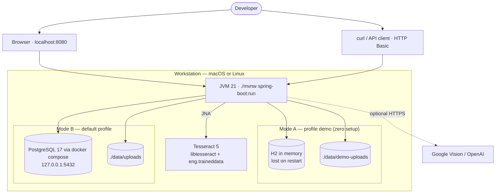
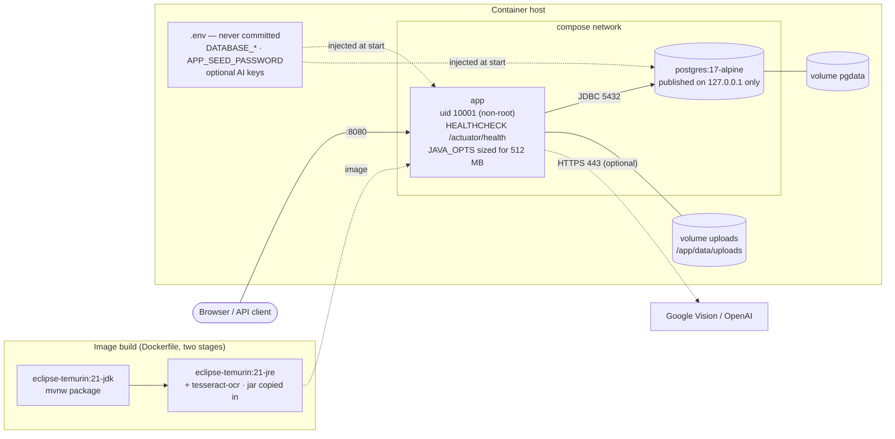
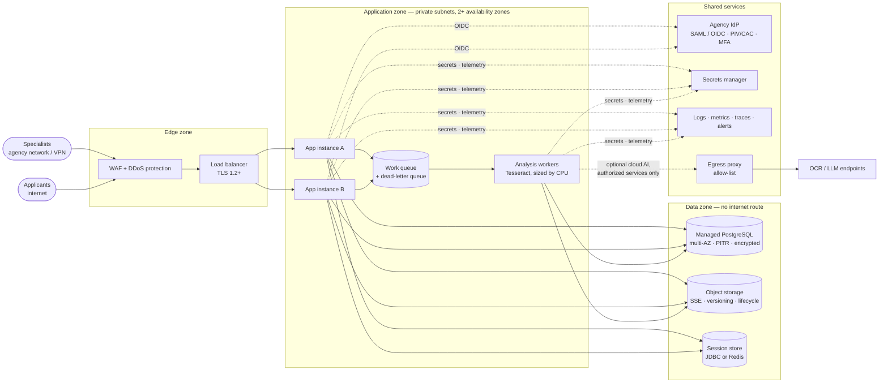
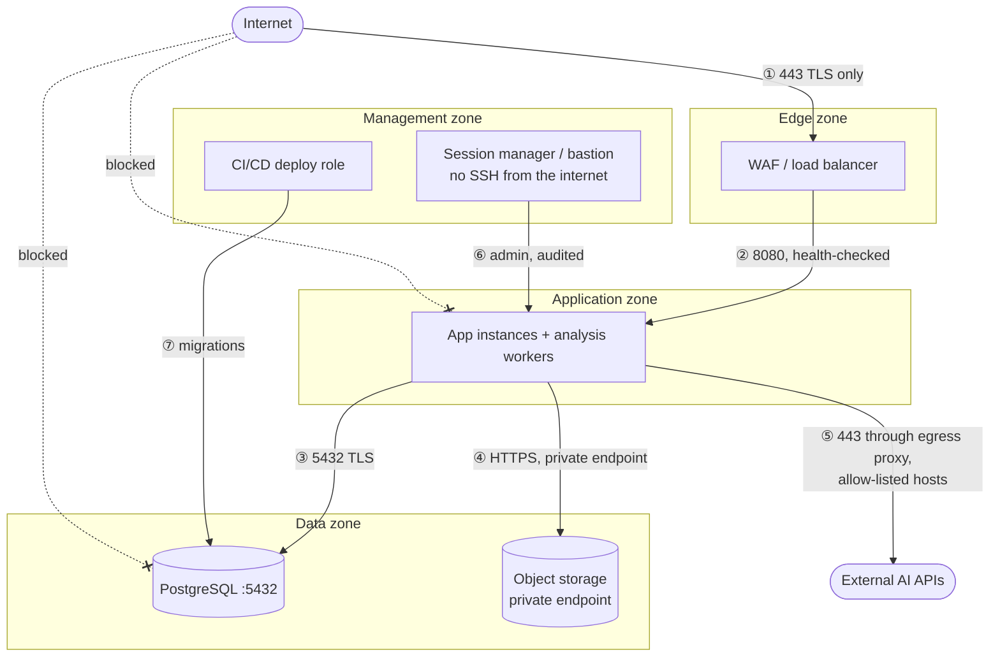
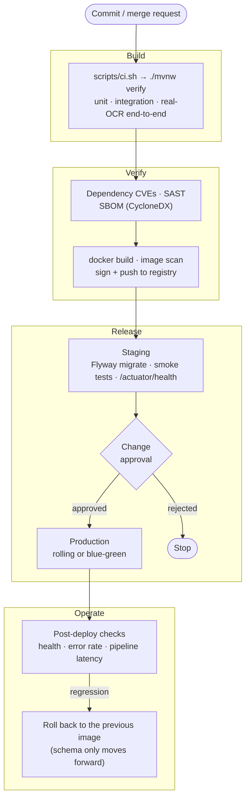
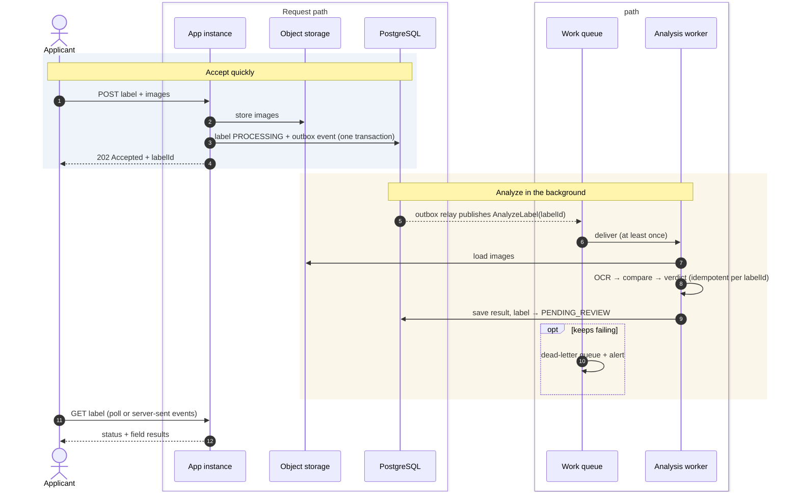

# Infrastructure

This page describes where TTB Label Verification runs, from a developer's laptop up to a production agency deployment, and how networking, secrets and delivery are organized around it. The inside of the application is described in [architecture.md](architecture.md).

## Contents

1. [Environments at a glance](#environments-at-a-glance)
2. [Local development](#1-local-development)
3. [Container topology](#2-container-topology)
4. [Production reference topology](#3-production-reference-topology)
5. [Network zones](#4-network-zones)
6. [CI/CD pipeline](#5-cicd-pipeline)
7. [Scaling target](#6-scaling-target)
8. [Configuration and secrets](#7-configuration-and-secrets)
9. [Sizing guidance](#8-sizing-guidance)
10. [Platform-as-a-service hosting](#9-platform-as-a-service-hosting)

---

## Environments at a glance

| Environment | Database | Image storage | Sessions | Who it's for |
|-------------|----------|---------------|----------|--------------|
| Laptop, `demo` profile | H2 in memory | `./data/demo-uploads` | H2 (lost on restart) | Trying it out, UI work |
| Laptop with Compose | PostgreSQL 17 container | `./data/uploads` | PostgreSQL | Development against the real database |
| Container host | PostgreSQL 17 container | `uploads` volume | PostgreSQL | Integration and staging |
| PaaS (Railway) | Managed PostgreSQL | Inside PostgreSQL | PostgreSQL | Demos and small teams |
| Production reference | Managed, multi-AZ PostgreSQL | Object storage | JDBC or Redis | An agency deployment |

## 1. Local development



<sub>Source: [diagrams/09-infra-local.mmd](diagrams/09-infra-local.mmd)</sub>

| Mode | Command | Database | Notes |
|------|---------|----------|-------|
| Demo | `./mvnw spring-boot:run -Dspring-boot.run.profiles=demo` | H2 in memory | Needs only Java 21 and Tesseract. Everything is gone after a restart. |
| Standard | `docker compose up -d postgres`, then `./mvnw spring-boot:run` | PostgreSQL 17 | Needs `DATABASE_USERNAME` and `DATABASE_PASSWORD` in `.env` |

Tesseract's library and language data are found automatically in Homebrew (`/opt/homebrew`), `/usr/local`, and Debian/Ubuntu locations. Otherwise, set `TESSERACT_LIBRARY_PATH` and `TESSDATA_PREFIX`.

> **Tip for UI work:** Spring Boot serves templates and CSS from `target/classes`, so restart `spring-boot:run` after editing files in `src/main/resources` to see the changes.

## 2. Container topology



<sub>Source: [diagrams/10-infra-container.mmd](diagrams/10-infra-container.mmd)</sub>

The `Dockerfile` builds in two stages. Maven produces the jar in a JDK image, and the jar is then copied onto `eclipse-temurin:21-jre` together with `tesseract-ocr`. `.dockerignore` keeps build output, local data and docs out of the build context. Hardening measures:

- The app runs as a non-root user, uid 10001.
- A `HEALTHCHECK` polls `/actuator/health`.
- `JAVA_OPTS` is sized for a 512 MB container by default (256 MB heap, serial GC, capped metaspace and code cache). Override it on bigger hosts, for example `JAVA_OPTS=-XX:MaxRAMPercentage=75`.
- `MALLOC_ARENA_MAX=2` and `OMP_THREAD_LIMIT=1` keep native memory predictable.
- PostgreSQL is published on `127.0.0.1` only.
- Credentials come from `.env` and are never built into the image. `docker compose` won't start without them.

```bash
docker compose --profile app up --build
```

## 3. Production reference topology

This layout isn't tied to one cloud. It maps directly onto AWS GovCloud, Azure Government, or an on-premises Kubernetes cluster.



<sub>Source: [diagrams/11-infra-production.mmd](diagrams/11-infra-production.mmd)</sub>

| Component | Job | Examples |
|-----------|-----|----------|
| WAF and load balancer | TLS termination, the OWASP rule set, rate limiting | AWS WAF + ALB, Azure Front Door + App Gateway, F5 |
| App instances (two or more, across zones) | The web UI and REST API. They hold no state apart from the shared session store. | ECS/EKS, AKS, OpenShift |
| Analysis workers | CPU-heavy OCR, scaled on queue depth | The same image, run with a worker profile |
| Work queue and DLQ | Separate taking a submission from analysing it ([§6](#6-scaling-target)) | SQS, Azure Service Bus, RabbitMQ |
| Managed PostgreSQL | The system of record, with multi-AZ failover, point-in-time recovery and encryption at rest | RDS/Aurora, Azure Database for PostgreSQL |
| Object storage | Label images, with server-side encryption, versioning and a retention lifecycle | S3 or Azure Blob, through a new `ImageStorage` implementation |
| Session store | HTTP sessions shared across instances | Spring Session with Redis or JDBC |
| Identity provider | SAML or OIDC with PIV/CAC and MFA | The agency IdP, Login.gov |
| Secrets manager | Database and API credentials, rotated | AWS Secrets Manager, Azure Key Vault, Vault |
| Observability | Logs, Micrometer metrics, traces, alerting | CloudWatch, Azure Monitor, Prometheus/Grafana, Splunk |
| Egress proxy | Outbound access only to approved AI endpoints | NAT plus a proxy, Azure Firewall |

## 4. Network zones

Traffic is denied by default. Only the flows drawn here are allowed.



<sub>Source: [diagrams/12-network-zones.mmd](diagrams/12-network-zones.mmd)</sub>

| From → to | Port and protocol | Why |
|-----------|-------------------|-----|
| Internet → edge | 443 TLS | Users and API clients |
| Edge → application | 8080 HTTP, private | Load-balanced traffic and health checks |
| Application → data | 5432 TLS | PostgreSQL |
| Application → object storage | HTTPS, private endpoint | Label images |
| Application → egress proxy → AI APIs | 443 TLS | The optional cloud pipeline, to approved hosts only |
| Management → application or data | Audited sessions | Operations and migrations |

Nothing can reach the data zone from the internet, and the data zone can't reach the internet.

## 5. CI/CD pipeline



<sub>Source: [diagrams/13-cicd-pipeline.mmd](diagrams/13-cicd-pipeline.mmd)</sub>

`scripts/ci.sh` is the one build entry point, and it isn't tied to any vendor. Jenkins, GitLab CI, Azure DevOps, TeamCity or Bamboo can run it on an agent that has Java 21, Tesseract and Docker:

```bash
./scripts/ci.sh
```

Add these around it in your CI system:

- Dependency CVE scanning (OWASP Dependency-Check or Grype) and static analysis.
- An SBOM (the CycloneDX Maven plugin).
- Image scanning and signing.
- Flyway migration as its own deploy step, before new instances start.
- Smoke tests against `/actuator/health`, plus one synthetic label submission.

Migrations only move forward. Rolling back therefore means redeploying the previous image against a schema that is still backward-compatible.

## 6. Scaling target

Today the analysis runs inside the submit request ([ADR-0008](adr/0008-synchronous-analysis-with-timeout-queue-based-evolution.md)). When volume grows, it moves to workers:



<sub>Source: [diagrams/14-scaling-target.mmd](diagrams/14-scaling-target.mmd)</sub>

- A transactional **outbox** makes sure that every stored label produces exactly one analysis event.
- Workers are **idempotent** per label ID, because delivery is at-least-once. Repeated failures land in a dead-letter queue and raise an alert.
- The label page polls, or listens to server-sent events, until the status leaves `PROCESSING`. The existing lazy recovery ([ADR-0011](adr/0011-lazy-status-recovery-instead-of-a-scheduler.md)) stays as the safety net.

## 7. Configuration and secrets

| Setting | Comes from | Secret? |
|---------|------------|---------|
| `DATABASE_URL`, `DATABASE_USERNAME`, `DATABASE_PASSWORD` | Secrets manager, then the environment | Yes (the password) |
| `APP_SEED`, `APP_SEED_PASSWORD`, `APP_SEED_*_EMAIL` | The environment. Set `APP_SEED=false` in production. | Yes (the password) |
| `APP_USERS` | Secrets manager, then the environment | Yes, if it holds plain passwords. Prefer bcrypt hashes. |
| `GOOGLE_VISION_API_KEY`, `OPENAI_API_KEY` | Secrets manager, then the environment | Yes |
| `OPENAI_MODEL`, `OPENAI_BASE_URL` | The environment | No |
| `TESSDATA_PREFIX`, `TESSERACT_LIBRARY_PATH` | The image or the environment | No |
| `APP_STORAGE_TYPE`, `APP_STORAGE_DIR` | The environment (plus a volume mount for the filesystem option) | No |
| Pipeline choice, approval threshold, SLA targets | The `settings` table, edited by specialists | No |

No credential has a default value in code or configuration files ([ADR-0014](adr/0014-no-credentials-in-code-configuration-defaults-or-documentation.md)).

## 8. Sizing guidance

These are starting points. The analysis time was measured locally on the 1600×2000 px synthetic labels; the rest are estimates to confirm with load tests.

| Resource | Guidance |
|----------|----------|
| Local analysis (measured) | About 0.5–0.8 s per single-image label. Scale workers by CPU cores. |
| Memory (estimate) | A 1 GB heap copes with concurrent 10 MB uploads. Allow about 200 MB more per concurrent OCR job. |
| Database (estimate) | Small: roughly 10 rows per label plus audit rows, with images stored elsewhere |
| Storage (estimate) | About 150 KB to 10 MB per image. Apply a retention lifecycle. |

## 9. Platform-as-a-service hosting

For a small deployment, a PaaS with two services is enough: the app container and managed PostgreSQL. The `railway` profile and the Dockerfile's JVM defaults fit a 512 MB container, peaking at 402 MB under 8 simultaneous submissions. When the platform allows only one volume, images are stored in PostgreSQL ([ADR-0018](adr/0018-small-container-profile-for-paas-hosting.md)).

The step-by-step guide is [deploy-railway.md](deploy-railway.md). The same profile works on any platform that terminates TLS and provides a `postgres://` database URL.
