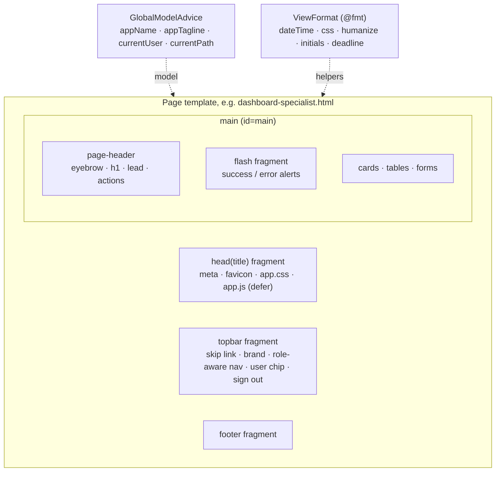

# UI Guide

How the server-rendered UI is put together: the page anatomy, the design tokens, the reusable components, and the rules every page follows. The reasoning is in [ADR-0003](adr/0003-server-rendered-ui-with-progressive-enhancement.md) (server rendering) and [ADR-0021](adr/0021-design-tokens-and-shared-page-chrome.md) (tokens and shared page chrome).

## Principles

| Principle | What it means in practice |
|-----------|---------------------------|
| Works without JavaScript | Every page is a Thymeleaf template, and forms post normally. `app.js` only adds conveniences such as select-all, confirm dialogs, overlay highlight, busy buttons, pre-fill and the demo-account picker. |
| Strict CSP | `style-src 'self'; script-src 'self'`. There are no inline styles or scripts, and no `style=` attributes. Everything visual lives in [`static/css/app.css`](../src/main/resources/static/css/app.css). |
| One stylesheet, tokens first | Colors, radii and shadows are CSS custom properties on `:root`. Components use tokens, never raw colors, so light and dark mode come from one set of rules. |
| Status is never color alone | Every badge has a text label and a dot. Field rows also carry the status as a word, and the colored edge is extra. |
| Mobile works | Every page is usable at 320 px with no horizontal page scroll. Wide tables scroll inside their card. |

## Page anatomy

Every signed-in page is built from the fragments in [`templates/fragments/layout.html`](../src/main/resources/templates/fragments/layout.html):

Source: [diagrams/16-ui-page-anatomy.mmd](diagrams/16-ui-page-anatomy.mmd)

- **Top bar:** a navy bar with a gold rule, sticky at the top. The navigation depends on the role: applicants see *New submission* and *Batch upload*, and specialists see *Applicants* and *Settings*. The current page gets `aria-current="page"` from `currentPath`, which also drives its highlight. On phones the nav becomes one horizontally scrollable row.
- **Page header:** an optional `.eyebrow` (section name or a back link), the `h1`, a one-line lead in `.muted`, and primary actions on the right.
- **Footer:** the product name and the rule that the AI proposes and a specialist decides.
- **Login and error pages** don't use the top bar. Login is a split screen: a brand panel with the three-step workflow, and the form. On phones it collapses to a compact header above the form. The error page is a centered card with the status code.

## Design tokens

Defined once on `:root` and redefined under `@media (prefers-color-scheme: dark)`.

| Group | Tokens | Use |
|-------|--------|-----|
| Surfaces | `--bg`, `--surface`, `--surface-2`, `--surface-3` | Page background, cards, table headers and hovers, counters |
| Lines | `--border`, `--border-strong` | Card borders, then input and table-header borders |
| Text | `--text`, `--muted` | Body text, and secondary text or labels |
| Brand | `--brand`, `--brand-strong`, `--brand-contrast`, `--gold`, `--gold-soft` | Primary buttons, step numbers, top-bar accents |
| Links and focus | `--accent` | Links, focus rings, overlay highlight |
| Status | `--ok`/`--ok-bg`, `--warn`/`--warn-bg`, `--bad`/`--bad-bg`, `--info`/`--info-bg` | Badges, alerts, stat stripes, field-row edges, bounding boxes |
| Shape | `--radius` (12 px), `--radius-sm` (8 px), `--shadow`, `--shadow-lg` | Cards, then inputs and buttons |
| Top bar | `--topbar-bg`, `--topbar-text`, `--topbar-muted` | App bar only |

## Components

| Component | Markup | Notes |
|-----------|--------|-------|
| Card | `.card`, optional `.card-header` | The main container. `.card-header` puts a title and a note on one line. |
| Stat tile | `.card.stat` + `.label` / `.value` / `.meta` | The colored top stripe comes from `sla-green` / `sla-amber` / `sla-red` (SLA metrics) or `tone-ok` / `tone-warn` / `tone-bad` / `tone-info`. Two per row on phones. |
| Badge | `.badge.badge-{status}` | The status class comes from `${@fmt.css(status)}`, for example `badge-needs-correction`, and the text from `${@fmt.humanize(status)}`. |
| Tabs | `nav.tabs > a(.active)` + `.count` | A segmented control. The active tab's count uses the brand color. |
| Table | `.table-wrap > table` | Sticky tinted header, row hover, and `td.num` for tabular numbers. Scrolls inside the card on small screens. |
| Field row | `tr.field-row.status-{status}` | The left edge shows the field status. Rows stack into blocks under 700 px. Hovering one highlights its bounding box (`#bbox-{id}`). |
| Alert | `.alert.alert-ok` / `-bad` / `-info` | Flash messages and notices, with a left accent edge. |
| Buttons | `.btn`, `.btn-primary`, `.btn-ghost`, `.btn-sm`, `.btn-link` | Primary is the brand navy. Ghost is for dark backgrounds. |
| Form | `fieldset` > `.form-grid` > `.field` (+ `.hint`, `.error-text`) | Fieldsets are cards. Wrap the form in `.steps` to number the legends. `.form-actions` keeps the submit bar in view on long forms. |
| File picker | `input[type=file]` | Styled as a dashed drop zone, with the browser's file button in brand color. |
| Timeline | `ul.timeline > li` | Decision history and analysis runs, as a vertical rule with dots. |
| Empty state | `.empty` | A centered message with a neutral icon. |
| Avatar | `.avatar(.avatar-sm)` + `.avatar-specialist` / `.avatar-applicant` | Initials from `${@fmt.initials(name)}`, used in the top bar and the demo picker. |

## Responsive rules

| Width | Change |
|-------|--------|
| ≤ 900 px | The label-detail split (image \| findings) becomes one column, and the image is no longer sticky. |
| ≤ 860 px | The top bar wraps: brand and user on the first row, nav below. The brand tagline and user name are hidden. The login brand panel shrinks to a header. |
| ≤ 700 px | Field-comparison rows stack: name and status, values, then review controls. |
| ≤ 560 px | Stat tiles go two per row with smaller values. |

Grid tracks use `minmax(0, 1fr)`, and grid children get `min-width: 0`, so a large label image or a long value can't widen the page.

## Adding a page

1. Create `templates/<name>.html` with `head('<Title>')`, `topbar`, `<main id="main">`, a `page-header`, the `flash` fragment, and `footer`.
2. Put the controller in `web.page` so `GlobalModelAdvice` supplies `appName`, `currentUser` and `currentPath`.
3. Add a nav link in `layout.html` inside the right `sec:authorize` block, with `th:aria-current` matching the path.
4. Use existing components and tokens. If something new is needed, add it to `app.css` under a commented section, using tokens only.
5. Check the page at 375 px and 1280 px, in light and dark mode, and with JavaScript disabled.

## Accessibility checklist

- A skip link is the first focusable element in the top bar, and `main` has `id="main"`.
- One `h1` per page. Section headings go in order.
- Every input has a `<label>`, or an `aria-label` for per-row controls in tables.
- Focus is always visible: a 2 px accent outline on buttons and links, and a 3 px focus ring on inputs.
- Motion respects `prefers-reduced-motion`.
- The demo-account picker is an ARIA combobox and listbox, with a `<noscript>` select as the fallback.
